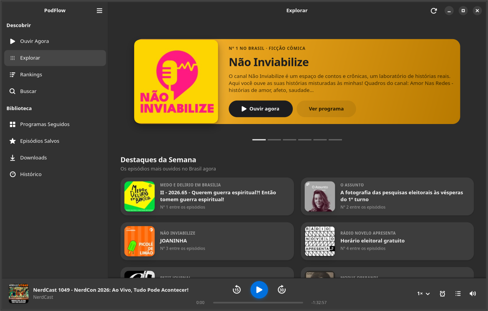
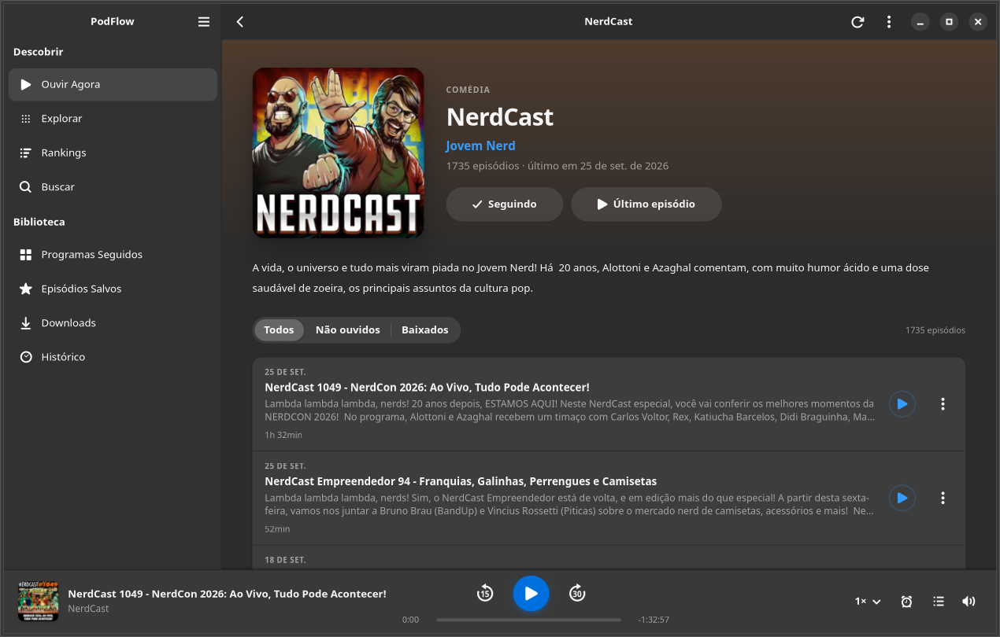
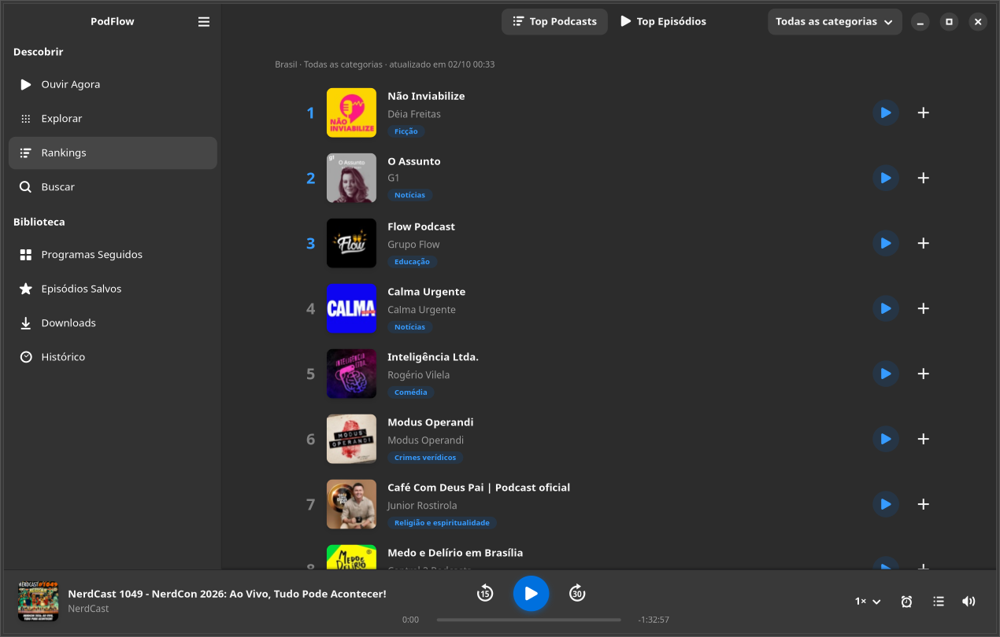
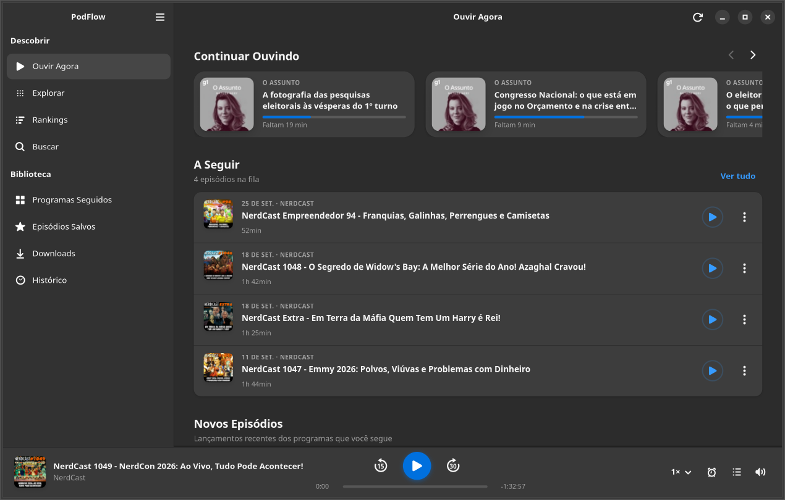
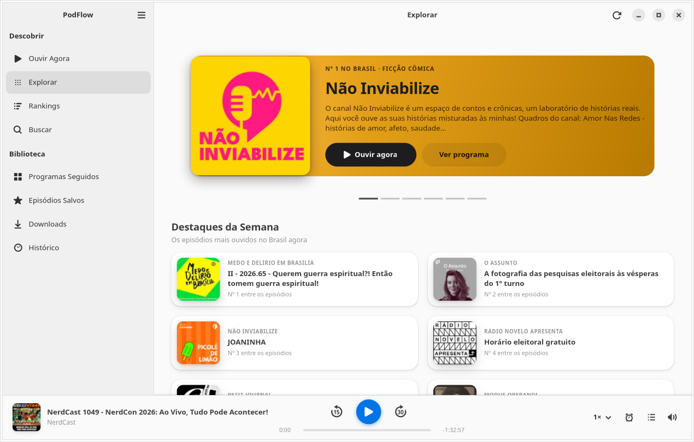
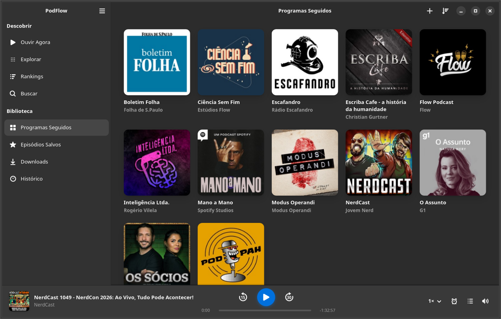
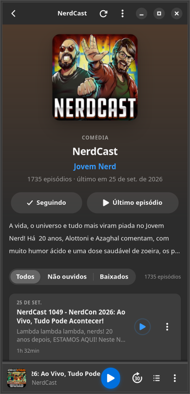

<div align="center">


# PodFlow

**Podcasts para o GNOME, com os rankings e as novidades do Brasil.**

App nativo para Linux feito com GTK 4, Libadwaita e GStreamer, inspirado na curadoria do
Apple Podcasts Brasil ([/charts](https://podcasts.apple.com/br/charts) e
[/new](https://podcasts.apple.com/br/new)) e adaptado às diretrizes de design do GNOME.

[](https://github.com/EuVinicios/Linux-Podcast/actions/workflows/ci.yml)
[](https://github.com/EuVinicios/Linux-Podcast/releases/latest)
[](LICENSE)



</div>

## Recursos

- **Explorar**: carrossel de destaques com a cor de cada capa, “Destaques da Semana”, “Em Alta” e
  prateleiras por gênero (Notícias, Comédia, Tecnologia, Sociedade e Cultura, Negócios,
  True Crime, Ciência e Educação).
- **Rankings**: Top Podcasts e Top Episódios do Brasil, de 1 a 50, com filtro por categoria.
- **Ouvir Agora**: Continuar Ouvindo (com barra de progresso), fila **A Seguir** e episódios novos
  dos programas que você segue.
- **Biblioteca**: programas seguidos com selo de novidades, episódios salvos, downloads e histórico.
- **Página do programa**: cabeçalho imersivo, descrição com “Ver mais” e filtros
  Todos / Não ouvidos / Baixados.
- **Player sempre à mão**: −15 s / +30 s, velocidade de 0,5× a 2,5× **sem alterar o tom da voz**,
  timer de sono (15/30/45/60 min ou fim do episódio), volume e fila retrátil com arrastar e soltar.
- **Integrado ao GNOME**: controles de mídia do GNOME Shell e teclas multimídia (MPRIS v2),
  bloqueio da suspensão enquanto toca, tema claro/escuro automático e notificações.
- **Offline-first**: abre com um catálogo de 12 podcasts brasileiros já na biblioteca; rankings,
  capas e episódios ficam em cache e os episódios podem ser baixados para ouvir sem internet.
- Busca no catálogo da Apple e adição de qualquer podcast pelo endereço do **feed RSS**.

| Programa | Rankings | Ouvir Agora |
|:---:|:---:|:---:|
|  |  |  |
| **Tema claro** | **Biblioteca** | **Celular / janela estreita** |
|  |  |  |

## Instalação

### Ubuntu 26.04 LTS (recomendado: pacote `.deb`)

O `.deb` usa o GTK, a Libadwaita e o GStreamer do próprio sistema, por isso é leve (≈ 70 KB) e se
integra perfeitamente ao Ubuntu.

1. Baixe `podflow_0.1.0_all.deb` na página de
   [**Releases**](https://github.com/EuVinicios/Linux-Podcast/releases/latest).
2. Instale pelo terminal, na pasta do download:

   ```bash
   sudo apt install ./podflow_0.1.0_all.deb
   ```

3. Abra **PodFlow** no menu de aplicativos.

Requer Ubuntu 26.04 ou mais recente (GNOME 50: GTK ≥ 4.20 e Libadwaita ≥ 1.9).
Para remover: `sudo apt remove podflow`.

### Outras distribuições (Flatpak)

```bash
flatpak remote-add --if-not-exists --user flathub https://dl.flathub.org/repo/flathub.flatpakrepo
flatpak install --user ./PodFlow.flatpak      # baixado da página de Releases
flatpak run io.github.euvinicios.PodFlow
```

### A partir do código-fonte

```bash
sudo apt install git make python3-gi gir1.2-gtk-4.0 gir1.2-adw-1 gir1.2-graphene-1.0 \
  gir1.2-gstreamer-1.0 gir1.2-gst-plugins-base-1.0 gstreamer1.0-plugins-good gstreamer1.0-libav
git clone https://github.com/EuVinicios/Linux-Podcast.git
cd Linux-Podcast
make run                  # ou: python3 -m src
sudo make install         # opcional: instala em /usr/local
```

## Atalhos de teclado

| Ação | Atalho |
|---|---|
| Reproduzir / pausar | <kbd>Espaço</kbd> |
| Voltar 15 s / avançar 30 s | <kbd>Ctrl</kbd>+<kbd>←</kbd> / <kbd>Ctrl</kbd>+<kbd>→</kbd> |
| Próximo da fila | <kbd>Ctrl</kbd>+<kbd>N</kbd> |
| Mostrar A Seguir | <kbd>Ctrl</kbd>+<kbd>U</kbd> |
| Buscar | <kbd>Ctrl</kbd>+<kbd>F</kbd> |
| Atualizar | <kbd>Ctrl</kbd>+<kbd>R</kbd> |
| Todos os atalhos | <kbd>Ctrl</kbd>+<kbd>?</kbd> |

## Desenvolvimento

```text
src/
├── main.py, window.py        # Adw.Application, janela, navegação e breakpoints
├── api/                      # Apple charts (JSON), iTunes Search/Lookup, parser RSS, gêneros
├── core/                     # SQLite, seed, GStreamer (playbin3 + scaletempo), fila, MPRIS, downloads
├── ui/                       # barra lateral (AdwSidebar), telas, componentes e style.css
└── utils/                    # cache de capas, formatação pt-BR, cores, tarefas em segundo plano
tests/                        # unittest: parsers, banco, áudio real, MPRIS e smoke test da interface
tools/screenshots.py          # percorre as telas e gera capturas (também usado como teste)
build-aux/                    # lançador, empacotamento .deb e manifesto Flatpak
```

| Comando | O que faz |
|---|---|
| `make run` | roda direto do código-fonte |
| `make test` | testes (com `xvfb-run` e `dbus-run-session` quando disponíveis) |
| `make test-live` | testa as APIs da Apple de verdade |
| `make screenshots` | regenera as capturas em `data/screenshots/` |
| `make deb` | gera `dist/podflow_<versão>_all.deb` |
| `make flatpak` | compila e instala o Flatpak localmente (requer `flatpak-builder`) |

Dados do usuário ficam em `~/.local/share/podflow/` (banco SQLite e downloads) e
`~/.cache/podflow/` (capas). Sem conta, sem rastreamento: o app conversa apenas com as APIs públicas
da Apple e com os servidores de cada podcast.

### Publicando uma versão

1. Atualize `VERSION` em `src/config.py`, o `CHANGELOG.md` e o `<releases>` do metainfo.
2. `git tag v0.2.0 && git push origin v0.2.0`. O GitHub Actions gera o `.deb`, o Flatpak e o
   `SHA256SUMS` e publica tudo na página de Releases.

## Fontes de dados

| Seção | Endpoint |
|---|---|
| Top Podcasts / Top Episódios | `rss.marketingtools.apple.com/api/v2/br/podcasts/top/50/{podcasts,podcast-episodes}.json` |
| Rankings por gênero | `itunes.apple.com/br/rss/toppodcasts/limit=50/genre={id}/json` |
| Detalhes, episódios e busca | `itunes.apple.com/lookup` e `itunes.apple.com/search` |
| Histórico completo e notas | o feed RSS de cada podcast |

Notas técnicas (verificadas em outubro de 2026):

- O host `rss.applemarketingtools.com` agora redireciona para `rss.marketingtools.apple.com`.
- A busca do iTunes ignora o parâmetro `genreId`, por isso as prateleiras por gênero usam os rankings
  por gênero.
- Os IDs antigos 1311 (Notícias) e 1315 (Ciência) foram substituídos por **1489** e **1533**.
- O *Café da Manhã* (Folha) é exclusivo do Spotify e não tem feed público. No catálogo inicial ele
  foi substituído pelo *Boletim Folha*.

## Aviso legal

O PodFlow é um projeto independente e **não é afiliado, patrocinado ou endossado pela Apple Inc.**
“Apple Podcasts” é marca registrada da Apple Inc. Nomes, capas e áudios dos podcasts pertencem aos
seus respectivos produtores e são exibidos a partir dos feeds públicos.

## Licença

[GPL-3.0-or-later](LICENSE) © 2026 EuVinicios.

---

<details>
<summary><b>English</b></summary>

PodFlow is a native GNOME podcast player (Python, GTK 4, Libadwaita, GStreamer) inspired by the
curation of Apple Podcasts in Brazil: top charts, an Explore page with featured shows and genre
shelves, an Up Next queue, continue listening, offline downloads, a sleep timer, pitch-preserving
speed control and MPRIS integration. The interface is in Brazilian Portuguese.

Install the `.deb` on Ubuntu 26.04+ (`sudo apt install ./podflow_0.1.0_all.deb`) or the Flatpak
bundle on other distributions. Both are on the
[Releases page](https://github.com/EuVinicios/Linux-Podcast/releases/latest).
Licensed under GPL-3.0-or-later. Not affiliated with Apple Inc.

</details>
